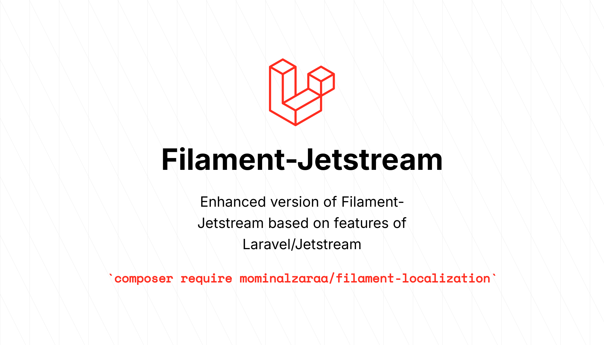

# Filament Jetstream — Enhanced Laravel Starter Kit Built With Filament

[](https://packagist.org/packages/mominalzaraa/filament-jetstream)
[](https://packagist.org/packages/mominalzaraa/filament-jetstream)
[](https://github.com/MominAlZaraa/filament-jetstream/actions/workflows/run-tests.yml)
[](https://github.com/MominAlZaraa/filament-jetstream/actions/workflows/code-style.yml)
[](https://github.com/MominAlZaraa/filament-jetstream/blob/main/LICENSE.md)
[](https://packagist.org/packages/mominalzaraa/filament-jetstream)
[](https://github.com/sponsors/MominAlZaraa)



**Requirements**: PHP ^8.3|^8.4 | Laravel ^12.0 | Filament ^4.0

## About This Package

This is an **enhanced version** of [stephenjude/filament-jetstream](https://github.com/stephenjude/filament-jetstream), which itself is inspired by the original [Laravel Jetstream](https://github.com/laravel/jetstream) package. 

**Note**: The original [Laravel Jetstream](https://github.com/laravel/jetstream) package has been discontinued by Laravel, as its functionality has been integrated into Laravel's official starter kits. However, this enhanced version brings back **all the powerful features** from the original Jetstream package, specifically focusing on **team features, mature data handling patterns, and seamless Filament UI integration**.

**Package Lineage**:
- **Original Laravel Jetstream** (discontinued): [laravel/jetstream](https://github.com/laravel/jetstream) - The inspiration for team features and mature data handling
- **Filament Implementation**: [stephenjude/filament-jetstream](https://github.com/stephenjude/filament-jetstream) - Original Filament port
- **This Enhanced Version**: [MominAlZaraa/filament-jetstream](https://github.com/MominAlZaraa/filament-jetstream) - Enhanced with complete Jetstream features and patterns

**What's Enhanced:**
- ✅ Complete team management features (add, remove, update roles)
- ✅ Proper invitation flow (register to accept, not auto-registration)
- ✅ Publishable Action classes with contracts (Jetstream pattern)
- ✅ Publishable language files with locale-first structure
- ✅ Enhanced email templates matching Jetstream's UI
- ✅ Custom validation rules (Role rule matching Jetstream)
- ✅ Better data handling aligned with Jetstream's mature patterns

### Main Purpose

This package is designed for developers who need:
- **Team/Collaboration Features**: Multi-tenant team management with roles, permissions, and invitations - the core feature that made [Laravel Jetstream](https://github.com/laravel/jetstream) powerful
- **Filament UI Integration**: Native Filament panels and components (not Livewire/Inertia views) - perfect for Filament-based applications
- **Full Customization**: Publishable Action classes and components for complete control - just like the original Jetstream
- **Production-Ready**: Battle-tested features from the original Laravel Jetstream package

**Primary Use Case**: If you're building a Filament-based application that needs team collaboration features (multi-tenant teams, member invitations, role management), this package provides the same level of functionality that the original Laravel Jetstream offered, but with Filament's beautiful UI components instead of Livewire/Inertia.

Filament Jetstream provides a beautifully designed application starter kit for Laravel with auth, registration, 2FA, session management, API tokens, and comprehensive team support, all implemented with **native Filament panels and components**.

Skip boilerplate, start building features.

## Installation

You can install the package via composer:

```bash
composer require mominalzaraa/filament-jetstream

php artisan filament-jetstream:install --teams --api
```

You can remove the `--teams` and `--api` arguments if you don't want those features.

After installation, the package will automatically publish Action classes and email templates that you can customize.

## Features

##### 🔐 Authentication


##### 👤 User Profile


##### 👥 Team (Optional)


##### 🔑 API Tokens (Optional)


##### 🌍 Translation-ready

## Enhanced Features (Compared to stephenjude/filament-jetstream)

This enhanced version includes comprehensive features inspired by the original [Laravel Jetstream](https://github.com/laravel/jetstream) package, bringing back the mature team collaboration features and data handling patterns that made Jetstream powerful:

### 🎨 **Complete Publishable Action Classes** (Laravel Jetstream Pattern)
All core functionality is now available as publishable Action classes, exactly like the original Jetstream package. Simply publish and modify:
- Profile update logic (`UpdateUserProfileInformation`)
- Team invitation handling (`InviteTeamMember`)
- Team member management (`AddTeamMember`, `RemoveTeamMember`, `UpdateTeamMemberRole`)
- Team operations (`CreateTeam`, `UpdateTeamName`, `DeleteTeam` with `ValidateTeamDeletion`)
- User deletion (`DeleteUser`)

This follows the same pattern as the original Laravel Jetstream's Action classes in `app/Actions/Jetstream/`, providing complete control over business logic.

### 📧 **Enhanced Email Invitation System** (Aligned with Laravel Jetstream)
Team invitation emails now intelligently handle both registered and unregistered users, exactly matching the original Jetstream's behavior:
- Shows "Create Account" button for users without accounts (when registration is enabled)
- Provides clear instructions for both registered and unregistered scenarios
- **Proper invitation flow**: Users must register/login to accept invitations (no auto-registration)
- Session-based invitation handling for seamless redirects
- Middleware automatically accepts pending invitations after authentication
- Handles invitation acceptance for both existing and new users correctly

### 🔧 **Contract-Based Architecture** (Laravel Jetstream Pattern)
All actions use Laravel-style contracts, matching the original Jetstream's architecture exactly:
- `UpdatesUserProfileInformation` contract
- `InvitesTeamMembers` contract
- `AddsTeamMembers` contract
- `RemovesTeamMembers` contract (new)
- `CreatesTeams`, `UpdatesTeamNames`, `DeletesTeams` contracts
- Easily swap implementations without modifying package code

### ✏️ **Easy Profile Field Customization** (Enhanced from Jetstream)
Add custom fields to your profile form (like surname, phone, etc.) by simply:
1. Publishing the Action class
2. Overriding the `getFieldComponents()` method
3. Adding your custom fields
4. Adding translations in `lang/{locale}/filament-jetstream.php`

All fields automatically load from your User model - no additional configuration needed! This makes it as easy as the original Jetstream's `UpdateUserProfileInformation` Action class.

**New Methods Available:**
- `getFieldComponents()` - Returns form fields without Section wrapper
- `getSectionHeading()` - Returns section title
- `getSectionDescription()` - Returns section description

### 🛡️ **Enhanced Team Management** (Jetstream-Level Features)
Complete team management with all the features from the original Jetstream:
- **Role Validation**: Custom `Role` validation rule (matches Jetstream's `Laravel\Jetstream\Rules\Role`)
- **Team Member Role Updates**: `UpdateTeamMemberRole` action class
- **Team Member Removal**: `RemoveTeamMember` action class with proper authorization
- **Team Deletion Validation**: `ValidateTeamDeletion` action class prevents deletion of personal teams
- **Proper Authorization**: All actions use Gate checks, matching Jetstream's security model

### 📦 **Publishable Components** (Jetstream-Style)
All components, views, Action classes, and language files can be published and customized, following the original Jetstream's publishable stubs pattern:
- Action classes in `app/Actions/FilamentJetstream/` (similar to Jetstream's `app/Actions/Jetstream/`)
- Email templates in `resources/views/vendor/filament-jetstream/emails/`
- Language files in `lang/{locale}/filament-jetstream.php` for better locale organization
- Full control over every aspect of the package, just like Jetstream allowed

### 🌍 **Publishable Language Files** (Locale-First Structure)
All translations are publishable with a locale-first structure (`lang/en/filament-jetstream.php`), making it easy to:
- Customize any existing translation
- Add translations for custom fields (like `surname`, `phone`, etc.)
- Add support for additional languages (just create `lang/fr/filament-jetstream.php`, etc.)
- Manage translations alongside your customizations
- Keep all translations for each locale in one place
- **Automatic merging**: Custom translations automatically override package translations

### 🔄 **Improved Team Invitation Flow** (Matches Jetstream)
The invitation acceptance flow now matches the original Jetstream's mature handling:
- **No auto-registration**: Users must register first, then accept invitation (proper flow)
- **Session-based redirects**: Invitation ID stored in session during registration/login
- **Automatic acceptance**: Middleware processes pending invitations after authentication
- **Email alignment**: Email template matches Jetstream's structure and messaging
- **Better error handling**: Proper validation and error messages

### ✅ **Data Handling Alignment** (Jetstream Patterns)
All data processing follows Jetstream's mature patterns:
- **Team creation**: `personal_team` always `false` (matches Jetstream)
- **User deletion**: Properly handles team detachment and owned team deletion
- **Validation rules**: Custom `Role` rule matches Jetstream's implementation
- **Event dispatching**: All events dispatched correctly (`TeamMemberRemoved`, `TeamMemberUpdated`, etc.)

## Customization Guide

### Publishing Action Classes

To customize core functionality, publish the Action classes:

```bash
php artisan vendor:publish --tag=filament-jetstream-actions
```

This will publish customizable Action classes to `app/Actions/FilamentJetstream/`:
- `UpdateUserProfileInformation.php` - Customize profile fields and section metadata
- `InviteTeamMember.php` - Customize team invitations with role validation
- `AddTeamMember.php` - Customize adding team members with role validation
- `RemoveTeamMember.php` - Customize removing team members (new)
- `UpdateTeamMemberRole.php` - Customize team member role updates (new)
- `CreateTeam.php` - Customize team creation
- `UpdateTeamName.php` - Customize team updates
- `DeleteTeam.php` - Customize team deletion
- `ValidateTeamDeletion.php` - Customize team deletion validation (new)
- `DeleteUser.php` - Customize user deletion with team handling

### Customizing Profile Fields

To add custom fields like `surname` to your profile form:

1. **Publish the Action class and language files** (if not already done):
```bash
php artisan vendor:publish --tag=filament-jetstream-actions
php artisan vendor:publish --tag=filament-jetstream-lang
```

2. **Add the translation** in `lang/en/filament-jetstream.php`:
```php
'form' => [
    'name' => ['label' => 'Name'],
    'surname' => ['label' => 'Surname'],  // Add your custom field translation
    'email' => ['label' => 'Email'],
    // ... other fields
],
```

3. **Edit** `app/Actions/FilamentJetstream/UpdateUserProfileInformation.php`:

```php
public function getFieldComponents(): array
{
    return [
        // ... existing fields ...
        TextInput::make('name')
            ->label(__('filament-jetstream::default.form.name.label'))
            ->string()
            ->maxLength(255)
            ->required(),
        TextInput::make('surname')  // Add your custom field
            ->label(__('filament-jetstream::default.form.surname.label'))  // Use translation
            ->string()
            ->maxLength(255),
        TextInput::make('email')
            ->label(__('filament-jetstream::default.form.email.label'))
            ->email()
            ->required(),
    ];
}
```

4. **Add the field to your User model's `$fillable` array**:
```php
protected $fillable = [
    'name',
    'email',
    'surname',  // Add your custom field
    // ...
];
```

That's it! The field will automatically load from your User model and save when the form is submitted. The translation will be used automatically.

### Publishing Email Templates

To customize email templates:

```bash
php artisan vendor:publish --tag=filament-jetstream-email-templates
```

This publishes templates to `resources/views/vendor/filament-jetstream/emails/` where you can customize the team invitation email and other email templates.

### Publishing Language Files

To customize translations and add translations for custom fields:

```bash
php artisan vendor:publish --tag=filament-jetstream-lang
```

This publishes language files to `lang/{locale}/filament-jetstream.php` (e.g., `lang/en/filament-jetstream.php`) for better locale organization. You can:
- Customize any existing translation
- Add translations for custom fields (like `surname`, `phone`, etc.)
- Add support for additional languages by creating new locale files

**Example: Adding Custom Field Translations**

After publishing the language files, edit `lang/en/filament-jetstream.php`:

```php
return [
    'form' => [
        'name' => ['label' => 'Name'],
        'surname' => ['label' => 'Surname'],  // Add your custom field
        'phone' => ['label' => 'Phone Number'],  // Add another custom field
        'email' => ['label' => 'Email'],
        // ... other fields
    ],
    // ... rest of translations
];
```

Then use it in your Action class:

```php
TextInput::make('surname')
    ->label(__('filament-jetstream::default.form.surname.label'))
```

**Adding New Languages:**

1. Publish the language files: `php artisan vendor:publish --tag=filament-jetstream-lang`
2. Copy `lang/en/filament-jetstream.php` to `lang/your-locale/filament-jetstream.php` (e.g., `lang/fr/filament-jetstream.php`)
3. Translate all values in the file
4. The package will automatically use the correct locale based on your app's locale setting

**Translation File Structure:**

The published files use a locale-first structure:
- `lang/en/filament-jetstream.php` - English translations
- `lang/fr/filament-jetstream.php` - French translations
- `lang/es/filament-jetstream.php` - Spanish translations
- `lang/el/filament-jetstream.php` - Greek translations
- etc.

This structure makes it easier to manage multiple locales and keeps all translations for a locale together.

**How It Works:**
- Custom translations from `lang/{locale}/filament-jetstream.php` automatically override package translations
- Package translations are used as fallback for any missing keys
- No configuration needed - just publish and customize!
- The translation loader automatically merges your customizations with package defaults

## Usage & Configurations

#### Configuring the User Profile
```php
use \App\Models\User;
use Filament\Jetstream\JetstreamPlugin;
use Illuminate\Validation\Rules\Password;

...
JetstreamPlugin::make()
    ->configureUserModel(userModel: User::class)
    ->profilePhoto(condition: fn() => true, disk: 'public')
    ->deleteAccount(condition: fn() => true)
    ->updatePassword(condition: fn() => true, Password::default())
    ->profileInformation(condition: fn() => true)
    ->logoutBrowserSessions(condition: fn() => true)
    ->twoFactorAuthentication(
        condition: fn() => auth()->check(),
        forced: fn() => app()->isProduction(),
        enablePasskey: fn() =>  Feature::active('passkey'),
        requiresPassword: fn() => app()->isProduction(),
    )
```

#### Configuring Team features

```php
use \Filament\Jetstream\Role;
use Filament\Jetstream\JetstreamPlugin;
use Illuminate\Validation\Rules\Password;
use \Filament\Jetstream\Models\{Team,Membership,TeamInvitation};

...
JetstreamPlugin::make()
    ->teams(
        condition: fn() => Feature::active('teams'), 
        acceptTeamInvitation: fn($invitationId) => JetstreamPlugin::make()->defaultAcceptTeamInvitation()
    )
    ->configureTeamModels(
        teamModel: Team::class,
        roleModel: Role::class,
        membershipModel: Membership::class,
        teamInvitationModel:  TeamInvitation::class
    )
```

#### Configuring API features
```php
use Filament\Jetstream\JetstreamPlugin;
use Illuminate\Validation\Rules\Password;
use \Filament\Jetstream\Role;
use \Filament\Jetstream\Models\{Team, Membership, TeamInvitation};

JetstreamPlugin::make()
    ->apiTokens(
        condition: fn() => Feature::active('api'), 
        permissions: fn() => ['create', 'read', 'update', 'delete'],
        menuItemLabel: fn() => 'API Tokens',
        menuItemIcon: fn() => 'heroicon-o-key',
    ),
```

## Existing Laravel projects

### Installing the Profile feature

#### Publish profile migrations
Run the following command to publish the profile migrations.

```bash
php artisan vendor:publish \
  --tag=filament-jetstream-migrations \
  --tag=passkeys-migrations \
  --tag=filament-two-factor-authentication-migrations
```

#### Add profile feature traits to the User model
Update the `App\Models\User` model:

```php
...
use Filament\Jetstream\HasProfilePhoto;
use Filament\Models\Contracts\HasAvatar;
use Spatie\LaravelPasskeys\Models\Concerns\HasPasskeys;
use \Filament\Jetstream\InteractsWIthProfile;

class User extends Authenticatable implements  HasAvatar, HasPasskeys
{
    ...
    use InteractsWIthProfile;

    protected $hidden = [
        ...
        'two_factor_recovery_codes',
        'two_factor_secret',
    ];

    protected $appends = [
        ...
        'profile_photo_url',
    ];
}
```

### Installing the Team Features

#### Publish team migration
Run the following command to publish the **team** migrations.
```bash
php artisan vendor:publish --tag=filament-jetstream-team-migration
```

#### Add team feature traits to User model
Update `App\Models\User` model to implement 'Filament\Models\Contracts\HasTenants' and use `Filament\Jetstream\InteractsWithTeams` trait.

```php
...
use Filament\Jetstream\InteractsWithTeams;
use Filament\Models\Contracts\HasTenants;

class User extends Authenticatable implements  HasTenants
{
    ...
    use InteractsWithTeams;
}

```

### Installing the API Features
#### Publish team migration
Run the following command to publish the **team** migrations.
```bash
php artisan vendor:publish --tag=filament-jetstream-team-migration
```

#### Add api feature trait to User model
Update `App\Models\User` model to  use `Laravel\Sanctum\HasApiTokens` trait.
```php
...
use \Laravel\Sanctum\HasApiTokens;

class User extends Authenticatable 
{
    use HasApiTokens;
}

```

## Testing

```bash
composer test
```

## Changelog

Please see [CHANGELOG](CHANGELOG.md) for more information on what has changed recently.

## Contributing

Please see [CONTRIBUTING](.github/CONTRIBUTING.md) for details.

## Security Vulnerabilities

Please review [our security policy](../../security/policy) on how to report security vulnerabilities.

## Key Differences from stephenjude/filament-jetstream

| Feature | stephenjude/filament-jetstream | This Enhanced Version | Original Laravel Jetstream |
|---------|-------------------------------|----------------------|---------------------------|
| **Action Classes** | Logic embedded in components | ✅ Complete publishable Action classes with contracts | ✅ Publishable Action classes |
| **Profile Customization** | Hardcoded fields | ✅ Easy field addition via `getFieldComponents()` | ✅ Customizable via Action classes |
| **Email Invitations** | Basic email, auto-registration | ✅ Smart emails with proper registration flow | ✅ Handles registered/unregistered users |
| **Invitation Flow** | Auto-creates users | ✅ Users must register/login (Jetstream pattern) | ✅ Proper registration flow |
| **Team Member Management** | Basic add/remove | ✅ Full CRUD: Add, Remove, Update Role | ✅ Complete team member management |
| **Role Validation** | Basic validation | ✅ Custom `Role` rule (matches Jetstream) | ✅ `Laravel\Jetstream\Rules\Role` |
| **Team Deletion** | Direct deletion | ✅ Validation action prevents personal team deletion | ✅ Proper validation |
| **Customization** | Limited | ✅ Full control via publishable files | ✅ Extensive publishable stubs |
| **Architecture** | Direct implementation | ✅ Contract-based (Laravel-style) | ✅ Contract-based architecture |
| **Team Features** | Basic implementation | ✅ Enhanced with Jetstream patterns | ✅ Comprehensive team management |
| **Language Files** | Package-only | ✅ Publishable with locale-first structure | ✅ Publishable translations |
| **Translation System** | Standard Laravel | ✅ Custom loader merges translations | ✅ Standard Laravel |
| **Data Handling** | Basic | ✅ Mature patterns matching Jetstream | ✅ Production-ready patterns |

### Why This Enhanced Version?

The original [Laravel Jetstream](https://github.com/laravel/jetstream) was discontinued because its features were integrated into Laravel's starter kits. However, if you need:
- **Team collaboration features** with Filament UI (not Livewire/Inertia)
- **The same level of customization** that Jetstream provided
- **Publishable Action classes** for complete control
- **Production-ready team management** features
- **Mature data handling patterns** from the original Jetstream
- **Proper invitation flows** (register to accept, not auto-registration)
- **Complete team member management** (add, remove, update roles)
- **Publishable translations** with locale-first structure

Then this enhanced version is the perfect solution, bringing Jetstream's powerful features and mature patterns to the Filament ecosystem.

### What Makes This Enhanced Version Different?

1. **Complete Feature Parity**: All team management features from Jetstream are implemented
2. **Proper Data Handling**: Follows Jetstream's mature patterns for invitations, team creation, and member management
3. **Enhanced Customization**: More publishable components than the original stephenjude version
4. **Translation Support**: Publishable language files with automatic merging
5. **Better Architecture**: All actions use contracts, making it easy to swap implementations
6. **Production-Ready**: Battle-tested patterns from the original Jetstream package

## Migration from stephenjude/filament-jetstream

If you're using the original [stephenjude/filament-jetstream](https://github.com/stephenjude/filament-jetstream) package, you can easily migrate:

1. **Backward Compatible**: The API remains the same - all existing code will work without changes
2. **Publish Action Classes**: Start customizing by publishing Action classes:
   ```bash
   php artisan vendor:publish --tag=filament-jetstream-actions
   ```
3. **Publish Language Files**: Get full translation control:
   ```bash
   php artisan vendor:publish --tag=filament-jetstream-lang
   ```
4. **Customize as Needed**: All enhancements are backward compatible - you can customize gradually
5. **No Breaking Changes**: Your existing configuration and code will continue to work
6. **Enhanced Features**: Immediately benefit from improved team invitation flow and better data handling

**Important Note on Team Invitations:**
The invitation flow has been enhanced to match Jetstream's pattern. Users must now register/login before accepting invitations (no auto-registration). This is more secure and follows best practices. Existing invitations will continue to work, but new invitations will follow the enhanced flow.

### Coming from Laravel Jetstream?

If you're familiar with the original [Laravel Jetstream](https://github.com/laravel/jetstream) package and want the same features but with Filament UI:

1. **Same Concepts**: Action classes, contracts, and publishable stubs work the same way
2. **Filament UI**: Instead of Livewire/Inertia views, you get native Filament components
3. **Team Features**: All the team collaboration features you're used to, now in Filament
4. **Easy Migration**: The patterns are familiar - just with Filament's component system

## Credits

This enhanced package builds upon the excellent work of:

- **Laravel Jetstream** (discontinued): [laravel/jetstream](https://github.com/laravel/jetstream) - The original inspiration for team features and Action class patterns
- **Filament Implementation**: [stephenjude](https://github.com/stephenjude) - [stephenjude/filament-jetstream](https://github.com/stephenjude/filament-jetstream) - Original Filament port
- **Laravel Framework**: [taylorotwell](https://github.com/taylorotwell) and the Laravel team
- **Enhanced Version**: [Momin Al Zaraa](https://github.com/MominAlZaraa) - [MominAlZaraa/filament-jetstream](https://github.com/MominAlZaraa/filament-jetstream) - Enhanced with complete Jetstream features and patterns
- [All Contributors](https://github.com/MominAlZaraa/filament-jetstream/contributors)

### Special Thanks

This package brings together the best of both worlds:
- **Laravel Jetstream's** mature team collaboration features and architecture patterns
- **Filament's** modern, beautiful UI components and developer experience
- **stephenjude's** initial Filament implementation

The result is a powerful, customizable starter kit that gives you Jetstream's team features with Filament's UI.

### Contact

For issues, questions, or contributions:
- **GitHub Issues**: [https://github.com/MominAlZaraa/filament-jetstream/issues](https://github.com/MominAlZaraa/filament-jetstream/issues)
- **Email**: support@mominpert.com
- **Repository**: [https://github.com/MominAlZaraa/filament-jetstream](https://github.com/MominAlZaraa/filament-jetstream)

## License

The MIT License (MIT). Please see [License File](LICENSE.md) for more information.
